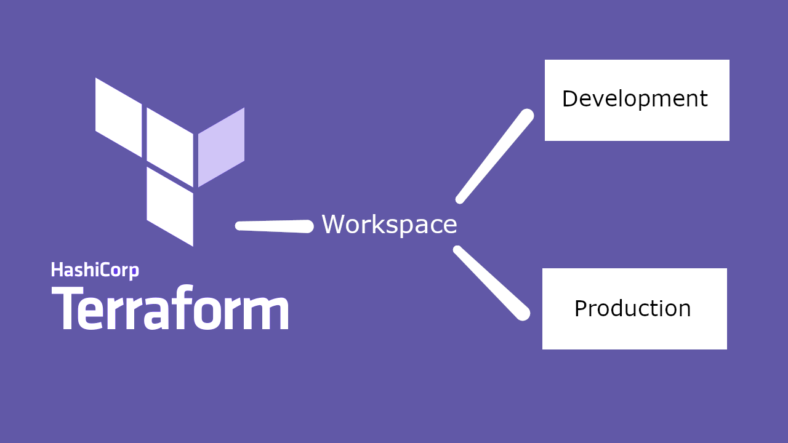
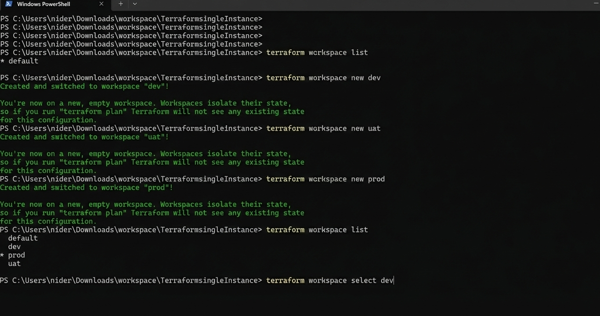

---

# Terraform Workspace Experiments







## Overview

This repository contains experiments with **Terraform workspaces**, used to manage multiple distinct states within the same configuration.

The purpose of this project was to learn how Terraform workspaces can be used to separate environments and maintain independent state files without duplicating code.

---

## What Was Implemented

* Used **Terraform workspaces** to create isolated state environments
* Explored workspace creation, selection, and switching
* Observed the behavior of resource provisioning across workspaces
* Verified that each workspace maintains its own state

---

## Key Commands

Below are some common Terraform workspace commands used during experimentation:

```bash
# List workspaces
terraform workspace list

# Create a new workspace
terraform workspace new dev

# Switch to a workspace
terraform workspace select prod

# Show current workspace
terraform workspace show
```

---

## What I Learned

* Workspaces allow you to separate state without copying configurations
* Each workspace maintains its own `.tfstate` file
* Resources created in one workspace do not affect another
* Helpful for simple environment separation (e.g., dev vs prod)

---

## Usage

1. Initialize Terraform:

   ```bash
   terraform init
   ```
2. Create or select a workspace:

   ```bash
   terraform workspace new staging
   ```
3. Apply infrastructure changes in that workspace:

   ```bash
   terraform apply
   ```

---

